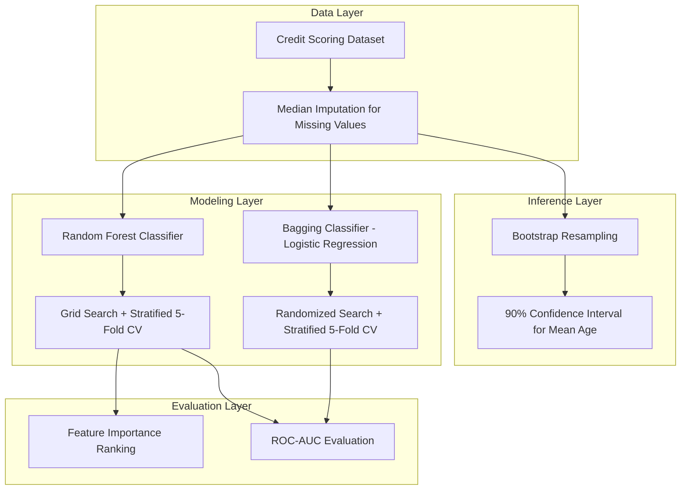

<div align="center">  </div>

---

# Credit Risk Scoring with Bootstrap Inference and Ensemble Learning

A statistical machine learning pipeline for predicting serious credit delinquency, combining non-parametric bootstrap confidence interval estimation with Random Forest and Bagging ensemble classifiers, evaluated through cross-validated hyperparameter search and ROC-AUC analysis.

<div align="left">

[](https://www.python.org/)
[](https://pandas.pydata.org/)
[](https://numpy.org/)
[](https://scikit-learn.org/)
[](#)
[](#)
[](#)
[](https://matplotlib.org/)
[](#)
[](https://opensource.org/licenses/MIT)

</div>

## Abstract

Predicting serious credit delinquency requires models that are both statistically grounded and robust to noisy, imbalanced financial data. This project builds an end-to-end credit risk scoring pipeline on a real-world credit scoring dataset, starting with non-parametric bootstrap resampling to estimate a confidence interval for the mean age of delinquent customers, followed by a Random Forest classifier tuned via grid search with stratified cross-validation. Feature importance analysis is then used to identify the weakest predictor of default risk, and a Bagging ensemble of Logistic Regression base estimators is tuned via randomized search as an alternative, more interpretable ensemble strategy. The two ensemble approaches are compared on held-out data using the ROC-AUC metric.

## Table of Contents

1. [Overview](#overview)
2. [Key Features](#key-features)
3. [System Architecture](#system-architecture)
4. [Methodology](#methodology)
   - 4.1 [Bootstrap Confidence Interval Estimation](#41-bootstrap-confidence-interval-estimation)
   - 4.2 [Random Forest Classification with Grid Search](#42-random-forest-classification-with-grid-search)
   - 4.3 [Feature Importance Analysis](#43-feature-importance-analysis)
   - 4.4 [Bagging Ensemble with Logistic Regression](#44-bagging-ensemble-with-logistic-regression)
5. [Dataset](#dataset)
6. [Results and Analysis](#results-and-analysis)
7. [Tools and Technologies](#tools-and-technologies)
8. [Project Structure](#project-structure)
9. [Installation](#installation)
10. [License](#license)
11. [Author](#author)
12. [Support](#support)

# Overview

This project addresses the problem of **serious credit delinquency prediction**, a core task in credit risk analytics where financial institutions must estimate the probability that a borrower will default within the next two years. Rather than relying on a single model, the pipeline combines classical statistical inference with modern ensemble learning to produce both a rigorous uncertainty estimate and a well-tuned predictive classifier.

Core components include:

* Data cleaning and missing-value imputation on a real credit scoring dataset
* Non-parametric bootstrap estimation of a confidence interval for a population statistic
* Random Forest classification tuned with grid search and stratified k-fold cross-validation
* Feature importance ranking to identify the least informative predictor
* Bagging ensemble of Logistic Regression base learners tuned with randomized search
* Comparative ROC-AUC evaluation across ensemble strategies

# Key Features

* Missing-value handling via median imputation
* Non-parametric bootstrap resampling for confidence interval estimation
* Random Forest classifier with class-balanced weighting
* Grid search over tree depth, leaf size, and feature subsampling with 5-fold stratified cross-validation
* Feature importance analysis for model interpretability
* Bagging ensemble of Logistic Regression estimators
* Randomized search over regularization strength, sample size, and feature subsampling
* ROC-AUC based model comparison on a held-out test split

---

# System Architecture

The pipeline follows a sequential statistical-to-predictive workflow: raw data is cleaned and prepared, a resampling-based inference step quantifies uncertainty in a key population statistic, and two independent ensemble classifiers are trained, tuned, and evaluated on the same train/test split for a fair comparison.



### Architectural Components

| Layer            | Responsibility                                                        |
| :----------------- | :---------------------------------------------------------------------- |
| Data Layer        | Loading, cleaning, and imputing the credit scoring dataset             |
| Inference Layer    | Bootstrap resampling and confidence interval estimation                |
| Modeling Layer     | Hyperparameter-tuned Random Forest and Bagging ensemble classifiers    |
| Evaluation Layer   | Feature importance ranking and ROC-AUC based performance comparison    |

---

# Methodology

## 4.1 Bootstrap Confidence Interval Estimation

The mean age of delinquent customers (`SeriousDlqin2yrs = 1`) is estimated using non-parametric bootstrap resampling. The delinquent subgroup's age values are resampled with replacement 1,000 times, and a 90% confidence interval is derived from the 5th and 95th percentiles of the resulting bootstrap distribution, avoiding any parametric assumption about the underlying age distribution.

## 4.2 Random Forest Classification with Grid Search

A class-balanced Random Forest classifier is trained to predict serious delinquency. Hyperparameters (`max_depth`, `max_features`, `min_samples_leaf`) are optimized with `GridSearchCV` using 5-fold stratified cross-validation, optimizing directly for ROC-AUC to account for the class imbalance inherent to credit default data.

## 4.3 Feature Importance Analysis

Using the impurity-based feature importances from the best Random Forest estimator, all predictors are ranked to identify which financial and demographic variables contribute most — and least — to the delinquency prediction, providing an interpretable view of the model's decision process.

## 4.4 Bagging Ensemble with Logistic Regression

As an alternative ensemble strategy, a Bagging classifier built on Logistic Regression base estimators is tuned via `RandomizedSearchCV`, searching over the regularization strength (`C`), the maximum sample fraction, and the maximum feature fraction per base estimator, again under 5-fold stratified cross-validation optimizing ROC-AUC.

---

# Dataset

The dataset consists of anonymized borrower records with the following features used to predict `SeriousDlqin2yrs` (whether a borrower experienced serious delinquency within two years):

| Feature | Description |
| :------- | :----------- |
| `age` | Age of the borrower |
| `NumberOfTime30-59DaysPastDueNotWorse` | Number of times 30–59 days past due |
| `DebtRatio` | Monthly debt payments, alimony, and living costs divided by monthly gross income |
| `NumberOfTimes90DaysLate` | Number of times 90 days or more past due |
| `NumberOfTime60-89DaysPastDueNotWorse` | Number of times 60–89 days past due |
| `MonthlyIncome` | Monthly income |
| `NumberOfDependents` | Number of dependents excluding the borrower |

Missing values (primarily in `MonthlyIncome` and `NumberOfDependents`) are imputed with the median of each column prior to modeling.

---

# Results and Analysis

### Bootstrap Confidence Interval

| Statistic | 90% Confidence Interval |
| :--------- | :------------------------ |
| Mean age of delinquent customers | **[45.71, 46.13]** |

### Random Forest — Best Configuration

| Parameter | Value |
| :--------- | :----- |
| `max_depth` | 10 |
| `max_features` | 2 |
| `min_samples_leaf` | 9 |
| **Test ROC-AUC** | **0.8334** |

### Feature Importance Ranking

| Feature | Importance |
| :------- | :---------- |
| NumberOfTime30-59DaysPastDueNotWorse | 0.2849 |
| NumberOfTimes90DaysLate | 0.2787 |
| NumberOfTime60-89DaysPastDueNotWorse | 0.1508 |
| age | 0.1157 |
| DebtRatio | 0.0874 |
| MonthlyIncome | 0.0649 |
| **NumberOfDependents (weakest predictor)** | **0.0175** |

### Bagging Ensemble — Best Configuration

| Parameter | Value |
| :--------- | :----- |
| `max_samples` | 0.7 |
| `max_features` | 2 |
| `estimator__C` | 100 |
| **Test ROC-AUC** | **0.7907** |

### Observations

- Delinquent customers show a fairly narrow bootstrap-estimated age range, suggesting age is a moderately concentrated risk factor rather than a strong standalone predictor.
- The Random Forest classifier (ROC-AUC ≈ 0.833) outperforms the Bagging ensemble of Logistic Regression models (ROC-AUC ≈ 0.791), indicating that non-linear tree-based splits capture delinquency patterns more effectively than a linear base learner on this dataset.
- Past payment delinquency indicators (30–59, 60–89, and 90+ days past due) dominate feature importance, while `NumberOfDependents` contributes the least predictive signal.

---

# Tools and Technologies

| Component | Purpose |
| :--------- | :------- |
| Pandas | Data loading, cleaning, and manipulation |
| NumPy | Bootstrap resampling and numerical computation |
| Scikit-learn | Random Forest, Bagging, GridSearchCV, RandomizedSearchCV, ROC-AUC |
| Matplotlib | Exploratory data visualization |
| SciPy | Statistical distributions for randomized search |

---

# Project Structure

```
Credit-Risk-Scoring-with-Bootstrap-Inference-and-Ensemble-Learning
│
├── credit_risk_ensemble_modeling.ipynb
├── credit_scoring_sample.csv
└── README.md
```

---

# Installation

## Clone Repository

```bash
git clone https://github.com/farzadjannati/Credit-Risk-Scoring-with-Bootstrap-Inference-and-Ensemble-Learning.git
cd Credit-Risk-Scoring-with-Bootstrap-Inference-and-Ensemble-Learning
```

## Create Environment

```bash
conda create -n credit-risk python=3.10
conda activate credit-risk
```

---

# License

This project is licensed under the MIT License.

---

## Author

**Parmida Ghamari**
M.Sc. Student, University of Tehran
Research Assistant @ Social Networks Lab

**Research Interests:** Applied Machine Learning, Credit Risk Modeling, Ensemble Learning (Random Forest, Bagging), Statistical Resampling Methods (Bootstrapping), Predictive Analytics

📧 [Parmida.ghamari@gmail.com](mailto:Parmida.ghamari@gmail.com) | 💻 [github.com/ParmidaGh](https://github.com/ParmidaGh) | 💼 [linkedin.com/in/parmida-ghamari](https://www.linkedin.com/in/parmida-ghamari)

---

# Support

If you find this project useful, consider giving it a star ⭐️

---

<p align="center">
Built using Pandas, NumPy, and Scikit-learn
</p>
